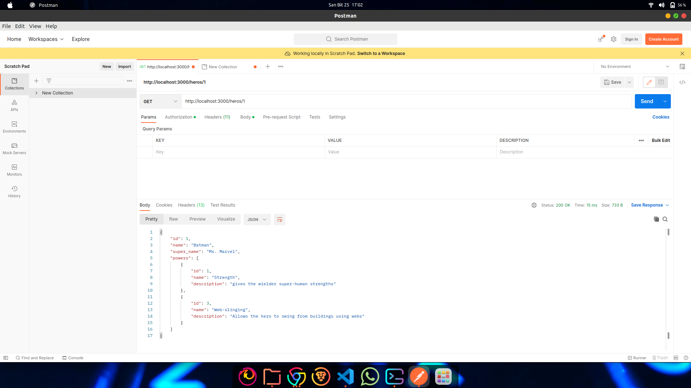
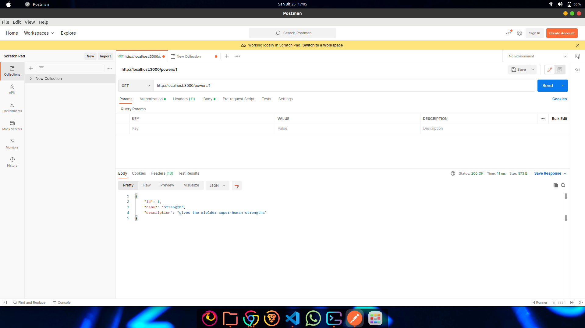
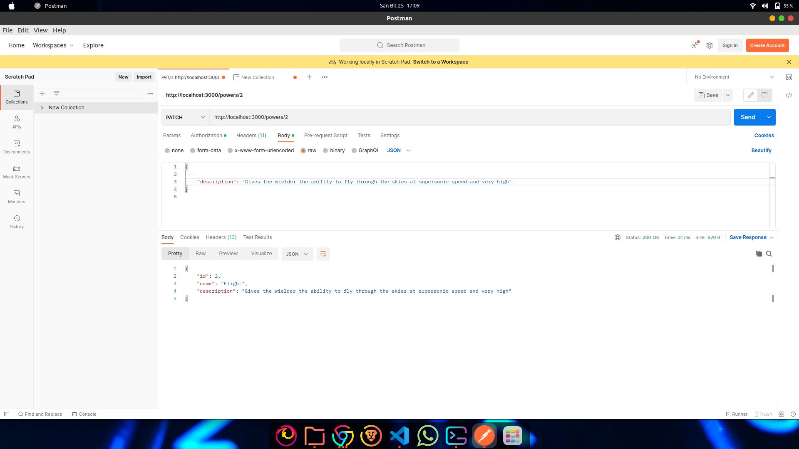
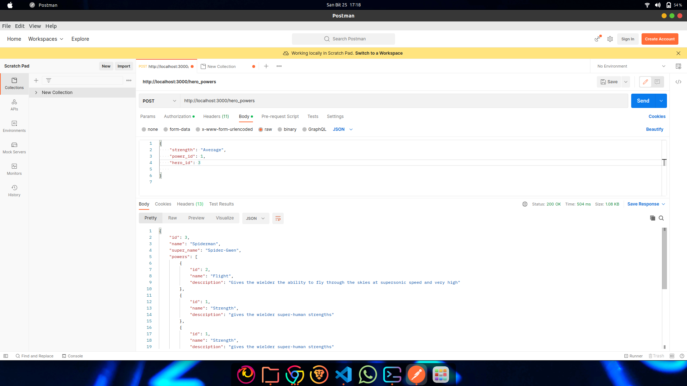

## Superheroes

### Description
For this assessment, you'll be working on an API for tracking heroes and their superpowers.

### Features
 It features three models: 
 - Hero
 - Power
 - HeroPower 
 The Hero model has a name and a super_name. 
 Power model has a name and a description. 
 The HeroPower model serves as a join table between Hero and Power and it contains a hero_id, power_id and has a strength attribute.

 ### Setup
 #### Instalation
 Clone the github repo `https://github.com/EvalyneMueke/heroes-and-superpowers`

 To install the necessary dependancies run:
 ` bundle install`

 Run the migrations and seeding the data:
 `Rails db:migrate db:seed`
 #### Server Running
 Start the server with ` rails server`

 ### Routes 
 Set up the following routes. Make sure to return JSON data in the format
specified along with the appropriate HTTP verb.

#### Get all the heros
` GET/heros`

Response:


#### Get a specific hero
`GET/heros/:id`
If the `Hero` exists, return JSON data in the format below:



If the `Hero` does not exist, return the following JSON data, along with
the appropriate HTTP status code:

{   "error": "Hero not found" }

#### Get all the Powers
 `GET /powers`
Return JSON data in the format below:


#### Get a specific powers
 `GET /powers/:id`
If the `Power` exists, return JSON data in the format below:



If the `Power` does not exist, return the following JSON data, along with
the appropriate HTTP status code:

```
{
  "error": "Power not found"
}
```
#### Updating the description of a power
`PATCH /powers/:id`
This route should update an existing `Power`. It should accept an object with
the following properties in the body of the request:



If the `Power` does not exist, return the following JSON data, along with
the appropriate HTTP status code:

```
{
  "error": "Power not found"
}
```

If the `Power` is **not** updated successfully (does not pass validations),
return the following JSON data, along with the appropriate HTTP status code:

```
{
  "errors": ["validation errors"]
}
```

#### Creating a new HeroPower
This route should create a new `HeroPower` that is associated with an
existing `Power` and `Hero`. It should accept an object with the following
properties in the body of the request:

```
{
  "strength": "Average",
  "power_id": 1,
  "hero_id": 3
}
```

If the `HeroPower` is created successfully, send back a response with the data
related to the `Hero`:



If the `HeroPower` is **not** created successfully, return the following
JSON data, along with the appropriate HTTP status code:

```
{
  "errors": ["validation errors"]
}
```
## LICENSE
MIT license
### Author
Evalyne Mueke


